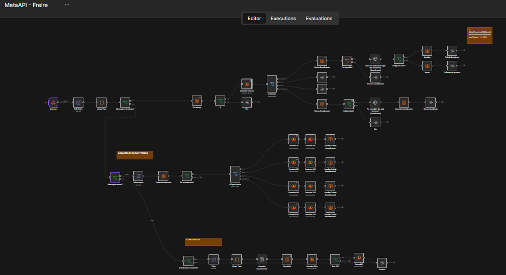

<div align="center">


<br>

<a href="https://www.linkedin.com/in/bruno-freire-log"></a> 

<br><br>

</div>

---

## 🛠️ Tecnologias e Ferramentas Utilizadas

<div align="center">

</div>

* **n8n (v2.35.7+):** Orquestração de fluxos, lógica condicional e tratamento de webhooks (instalado globalmente).
* **Chatwoot (v4.17.0+):** Camada de atendimento omnichannel rodando via Docker.
* **WhatsApp CloudAPI:** Mensageria oficial da Meta (conectada diretamente ao Chatwoot).
* **Firebird / SQL:** Banco de dados do ERP integrado via nó da comunidade (`n8n-nodes-banco-firebird`).
* **Cloudflare Tunnels:** Exposição segura de webhooks para o ambiente externo.

---

## 📋 Sobre o Projeto
Este repositório documenta a arquitetura de uma solução desenvolvida para otimizar operações de suporte técnico e atendimento ao cliente. O fluxo automatiza a recepção de mensagens, realiza validações em tempo real no banco de dados e direciona as demandas de forma inteligente, abrindo Ordens de Serviço (OS) e concluindo chamados automaticamente.

### ✨ Principais Funcionalidades do Fluxo
* **Roteamento Inteligente:** Identifica se o contato pertence a uma empresa cadastrada no banco de dados com atendimento em andamento ou se é um novo lead.
* **Cadastro de Ordens de Serviço (OS):** Subfluxo dedicado ao registro automatizado de chamados direcionados ao técnico correto.
* **Integração Nativa com Firebird:** Consultas e manipulações dinâmicas utilizando o conector específico de comunidade para o SGBD.
* **Encerramento Automatizado:** Disparo de rotinas de conclusão de OS baseado no status da conversa no Chatwoot ("Resolvida").

---

## 📊 Arquitetura e Fluxo de Dados
A comunicação entre as camadas ocorre da seguinte forma:
1. A **CloudAPI da Meta** envia as mensagens para o **Chatwoot**.
2. O **Chatwoot**, através das configurações nativas de Webhooks, repassa os eventos para o **n8n**.
3. O **n8n** processa as regras de negócio, consulta o banco **Firebird** e executa as ações no ERP.

<div align="center">
  
</div>

---

## 💻 Requisitos de Infraestrutura e Sistema

### ⚙️ Configuração Mínima Viável
* **Memória RAM:** 4 GB livres dedicados à stack.
* **Armazenamento:** 5 GB de espaço livre em disco *(para acomodar containers Docker, volumes do Chatwoot, Node.js e n8n)*.
* **Sistema Operacional:** Windows 10 / 11 ou ambientes Linux compatíveis.

### ⭐ Configuração Recomendada
* **Memória RAM:** 8 GB (com pelo menos 6 GB livres).
* **Armazenamento:** 5 GB+ em SSD.
* **Sistema Operacional:** Windows 10/11 ou Servidor Linux.

---

## 🚀 Guia de Configuração e Reprodução do Ambiente

### 1. Pré-requisitos na Máquina
* **Node.js:** Versão 22 LTS (ou superior) instalada para gerenciar o n8n globalmente.
* **Docker e Docker Compose:** Para rodar a infraestrutura do Chatwoot de forma isolada.
* **Cloudflare Tunnels:** Essencial para expor o n8n para a web.*

### 2. Subindo o Chatwoot via Docker
No seu arquivo de configuração de containers (`docker-compose.yml`), certifique-se de manter a versão estável do Chatwoot (`v4.17.0` ou superior) e suba os serviços:
```bash
docker compose up -d


### 📚 Documentação Adicional
* [🛡️ Guia Prático: Como se Tornar um Tech Provider da Meta](docs/como-ser-tech-provider.md) — Passo a passo detalhado cobrindo a preparação de conta, validação por domínio, gravação do screencast, cuidados com o status de desenvolvimento e o fluxo de *Embedded Signup* no Chatwoot.
